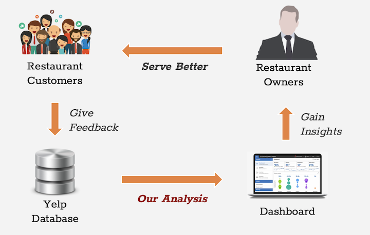

# Yelp Review Analysis

## Project Background 
Nowadays, people can recommend a restaurant to others simply by writing a review on Yelp. They can write anything about a restaurant, including parking, location, services, environment and food. For foodies, they can use these reviews as references to decide if they want to try a restaurant or not. Also, for restaurant owners, they could use these reviews to evaluate the performance of their restaurants. They could identify their popular dishes, improve their services or change their layouts accordingly. 

## Project Overview
We performed text analytics on yelp dataset to derive business insights from customers’ restaurant reviews. We provide restaurant owners/ managers with a dashboard summary to inform them of the improvement areas. We hope these insights could help restaurants better serve their customers. 

## Technical Architecture
The data was downloaded from [Yelp Open Dataset](https://www.yelp.com/dataset) in JSON format. The dataset contains 192,609 businesss and 6,685,900 reviews. Due to the large scale of the dataset, we performed our analysis using Amazon Web Services(AWS) and Pyspark. To be specific, we used Amazon S3 for data storage, Amazon EC2 and EMR for cloud computing and transformation. We also used Pyspark on Databricks for sentiment analysis and predictive modeling. 

## Project Walkthrough
The analysis consists of 3 parts: 

- Exploratory analysis on the overall review trends across time
- Predictive modeling to identify misclassified reviews and calculate the polarity score based on sentiment analysis 
- Latent Dirichlet Allocation (LDA) model to determine key topics among reviews in negative and positive sentiments; Identify key words in each topic

## 1. Exploratory data analysis (EDA): 
We created visualizations for: 
- Average ratings of each resturant
- Total number of reviews for each rating
- Total number of reviews each month/year

## 2. Predictive Modeling 

There is a misconception between rating score and customer satisfaction. High rating score may not imply high satisfaction (Eg: a 4-star rating may include negative comments since this customer thinks there’s improvement to be made). Therefore, we use sentiment analysis to quantify opinion (by generatin polarity scores) solely based on texts. We built a linear regression model to identify comments that are in align with their ratings. Then we used these comments as the training data to build a SVM model. The model will predict whether the reviews are misclassified or not. The model is built in Pyspark, and the code can be found [here](https://github.com/peterwei425/Yelp-Review-Analysis/blob/master/SVM_sentiment.ipynb). 

## 3. Latent Dirichlet Allocation(LDA) and Topic Modeling 

After we identified positive and negative sentiments, we would like to further explore what specific messages they conveyed. For example, among all negative reviews, what aspects of restaurants do they talk about the most? Do they complain about food, services or environments?

To solve this problem, we used topic modeling to identify key messages or topics customers are talking about. We determine number of topics based on coherence score, which measures score a single topic by measuring the degree of semantic similarity between high scoring words in the topic. Then we identified the topic based on the word distribution of the topic. 

The LDA model was built in Python using [gensim](https://pypi.org/project/gensim/), and LDA visualizations was built with [pyLDAvis](https://pypi.org/project/pyLDAvis/). The code which extracted 3 resturants in Las Vegas can be found [here](https://github.com/peterwei425/Yelp-Review-Analysis/blob/master/LDA.ipynb). 

 
